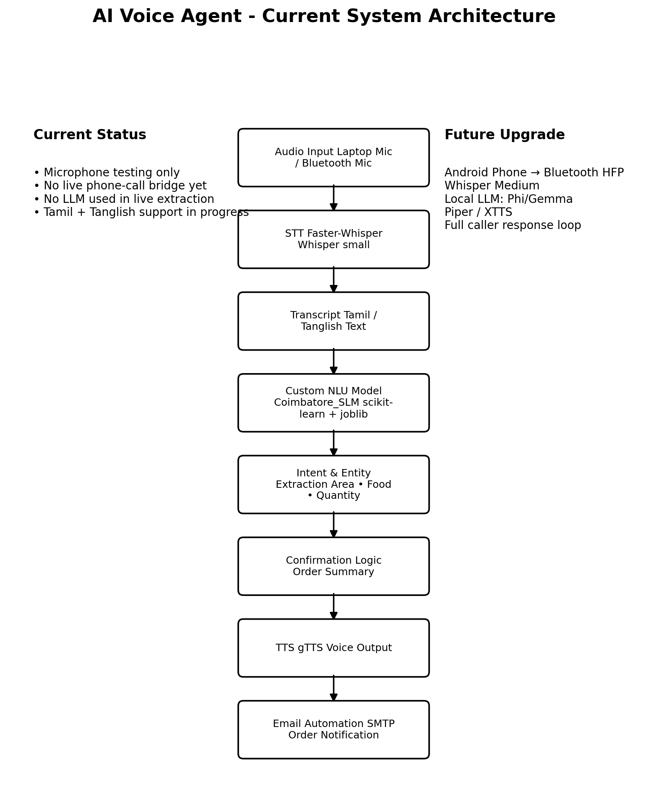
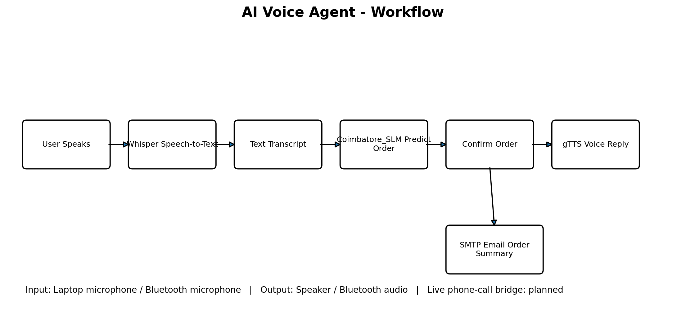

# AI Voice Agent

An AI-powered voice assistant capable of handling real-time customer conversations through speech recognition, natural language processing, and text-to-speech synthesis. The project is designed to automate customer interactions such as restaurant order taking, query handling, and email notifications.

---

## Demo

### Current Status

* Speech-to-Text using Faster-Whisper
* Tamil and Tanglish Order Extraction
* Custom Scikit-Learn SLM
* gTTS Voice Responses
* SMTP Email Automation
* Microphone Testing Completed
* Bluetooth Microphone Testing Completed
* Phone Call Integration In Progress

---

## Key Features

* Tamil and Tanglish speech processing
* Faster-Whisper based speech recognition
* Custom machine learning order extraction model
* Automated email notification system
* Modular architecture for future phone-call integration
* Real-time voice interaction workflow
* Extensible design for future LLM integration

---

## Architecture Diagram



---

## Workflow Diagram



---

## Project Overview

This project demonstrates how Artificial Intelligence can be integrated with voice technologies to create an autonomous voice assistant.

The AI Voice Agent listens to user speech, converts it into text, processes the request using a custom machine learning model, generates an appropriate response, converts the response back into speech, and communicates it to the user.

The system can also trigger automated actions such as email notifications based on the conversation.

---

## Features

* Real-time voice conversation handling
* Speech-to-Text (STT) processing
* AI-powered order extraction
* Text-to-Speech (TTS) synthesis
* Restaurant order-taking workflow
* Automated email notifications
* Modular architecture for future integrations
* Tamil language support

---

## System Architecture

```text
User Speech
      │
      ▼
Faster-Whisper STT
      │
      ▼
Tamil/Tanglish Transcript
      │
      ▼
Coimbatore_SLM
(Scikit-Learn Model)
      │
      ▼
Order Extraction
(Food, Area, Quantity)
      │
      ▼
Response Generation
      │
      ▼
gTTS
      │
      ▼
Voice Response
      │
      ▼
SMTP Email Notification
```

---

## Tech Stack

### Programming Language

* Python

### Speech Processing

* Faster-Whisper

### Machine Learning

* Scikit-Learn
* Joblib

### Text-to-Speech

* gTTS

### Communication

* SMTP Email Automation

### Development Tools

* Linux
* Git
* GitHub
* Virtual Environment (venv)

---

## Project Structure

```text
AI-voice-Agent/
│
├── slm/
│   └── Custom Order Extraction Model
│
├── stt/
│   └── Faster-Whisper Components
│
├── tts/
│   └── gTTS Components
│
├── utils/
│   └── Helper Functions
│
├── tests/
│   └── Test Scripts
│
├── agent.py
├── requirements.txt
├── LICENSE
├── architecture.png
├── workflow.png
└── README.md
```

---

## Workflow

1. User speaks through the microphone.
2. Faster-Whisper converts speech into text.
3. Tamil/Tanglish text is processed by the custom Coimbatore_SLM model.
4. The model extracts food items, quantities, and location information.
5. The system generates a confirmation response.
6. gTTS converts the response into speech.
7. The generated voice is played back to the user.
8. Order details are sent through email notifications.

---

## Current Technology Stack

| Component        | Technology                 |
| ---------------- | -------------------------- |
| STT              | Faster-Whisper             |
| TTS              | gTTS                       |
| NLU              | Custom Coimbatore_SLM      |
| ML Framework     | Scikit-Learn               |
| Email            | SMTP                       |
| Language         | Tamil + Tanglish           |
| Audio Input      | Laptop Mic / Bluetooth Mic |
| Call Integration | In Progress                |

---

## Future Improvements

* Live phone-call integration
* Bluetooth HFP call routing
* Local LLM integration (Phi-3, Gemma)
* Piper or XTTS voice synthesis
* Multi-language support
* Database-backed order management
* WhatsApp integration
* Cloud deployment

---

## Learning Outcomes

Through this project, I gained practical experience in:

* Speech Recognition
* Text-to-Speech Systems
* Voice AI Applications
* Machine Learning Model Integration
* Python Application Development
* Linux-based Development
* Email Automation
* Modular Software Architecture

---

## Author

**Vishwa Sabaris V**

B.E. Computer Science and Engineering (Artificial Intelligence & Machine Learning)

Kalaignar Karunanidhi Institute of Technology (KIT), Coimbatore
